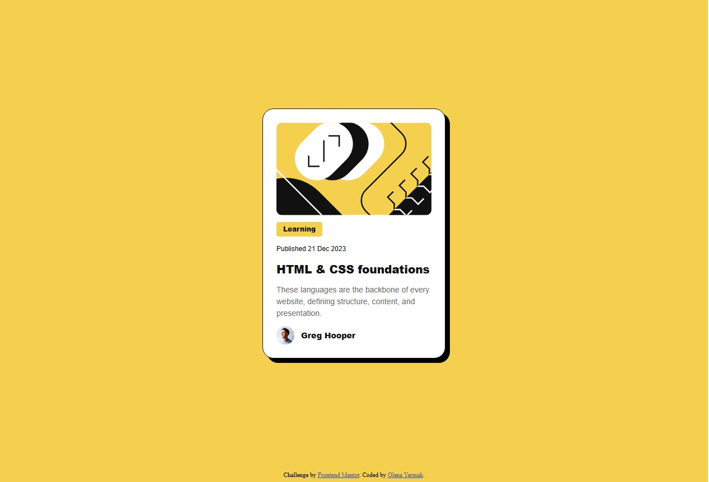

# Frontend Mentor - Blog preview card solution

This is a solution to the [Blog preview card challenge on Frontend Mentor](https://www.frontendmentor.io/challenges/blog-preview-card-ckPaj01IcS). Frontend Mentor challenges help you improve your coding skills by building realistic projects.

## Table of contents

- [Overview](#overview)
  - [Screenshot](#screenshot)
  - [Links](#links)
- [My process](#my-process)
  - [Built with](#built-with)
  - [What I learned](#what-i-learned)
- [Author](#author)

## Overview

This project is a simple yet elegant **blog preview card component** that displays an article preview with an image, title, publication date, category, short description, and author information. The layout is mobile-first and responsive, using CSS media queries for desktop adjustments. The card design includes hover effects and modern styling using custom properties and Flexbox.

### Screenshot

### Links

- Solution URL: [GitHub Repo](https://github.com/OlenaYermak/blog-preview-card-main)
- Live Site URL: [Live Demo](https://olenayermak.github.io/blog-preview-card-main/)

## My process

### Built with | Використано

- Semantic **HTML5** markup
- **CSS custom properties** (variables)
- **Flexbox** layout model
- **Responsive design** with media queries
- **Mobile-first approach**
- **Google Fonts** – [Figtree](https://fonts.google.com/specimen/Figtree)

### What I learned

I practiced building a responsive UI component using semantic HTML and Flexbox. I also improved my skills in organizing CSS with reusable custom properties and learned how to structure scalable and clean class naming.

## Author

- GitHub – [OlenaYermak](https://github.com/OlenaYermak)
- Frontend Mentor – [@OlenaYermak](https://www.frontendmentor.io/profile/OlenaYermak)
